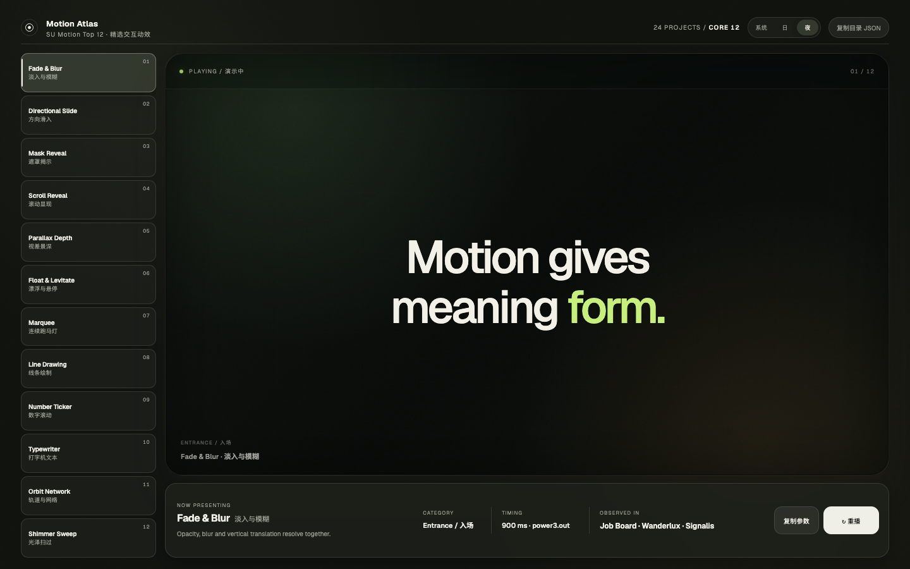

# SU Motion Top 12

**中文** | [English](#english)

> 不是再造一个动画库，而是给 AI 一层经过筛选的 Web 与 Video Motion 决策和质感标准。

`SU Motion Top 12` 是一个面向 AI 编程与创作工具的跨媒介动效图谱：12 个高频、精致、可解释、可验证的 Motion，由同一套 Core 12 服务实时网页和帧驱动视频，并通过不同适配层交给 CSS、GSAP、Motion、HyperFrames 或 Remotion 实现。

## 先体验

[打开可点击的 Motion Atlas →](assets/motion-atlas/index.html)

Web 演示支持 System、Light、Dark 三态主题。点击左侧任一 Motion，右侧会立即播放；底部可以查看用途、参数、来源并复制 JSON。

如果 GitHub 没有直接运行 HTML，请先克隆仓库，再启动本地预览：

```bash
python3 -m http.server 4173
# 浏览器访问 http://localhost:4173/assets/motion-atlas/
```

## 安装到 Codex

最简单的方法，是把下面这段话和当前仓库链接一起发给 Codex：

```text
请把这个 GitHub 仓库安装为我本机的 Codex Skill。
仓库地址：https://github.com/doublesq97-ui/su-motion-top12
目标目录：~/.codex/skills/su-motion-top12

安装前先检查是否已经存在同名目录；不要直接覆盖我的本地修改。
安装完成后读取 SKILL.md，运行 npm run validate，并告诉我验证结果和使用方式。
```

也可以手动安装：

```bash
git clone https://github.com/doublesq97-ui/su-motion-top12.git ~/.codex/skills/su-motion-top12
cd ~/.codex/skills/su-motion-top12
npm run validate
```

## 开始使用

```text
用 su-motion-top12 给我看常用网页动效目录。
```

```text
用 su-motion-top12 为这个产品 Hero 选择并实现一个克制的入场动效。
```

```text
使用 08 Line Drawing，把这段数据流程做成可重播的网页动效。
```

```text
用 su-motion-top12 为这段 9:16 HyperFrames 产品视频选择并实现一个主 Motion，完成预览和渲染验证。
```

## 一个 Skill，两条执行路径

用户始终调用同一个 `su-motion-top12`：

- 目标是网页时，AI 保留 hover、scroll、pointer、主题和 Reduced Motion 等实时交互语义，并使用目标项目已有的 Web 技术栈。
- 目标是视频时，AI 把同一 Motion 翻译为帧、镜头和时间轴；未指定引擎时默认交给 HyperFrames，明确指定或已有 Remotion 项目时使用 Remotion。

Core 12 只负责选型、节奏、组合和质感标准。具体代码、媒体、渲染与导出由目标引擎负责，因此无需为 Web 和 Video 维护两份目录。



它解决的不是“运行库能不能让画面动”，而是三个更常见的问题：

- AI 面对无限动画可能时应该选哪个？
- 为什么技术上能运行的动效仍然显得廉价或混乱？
- 怎样让不同 Agent 稳定地产出相近质量，而不是每次重新猜？

## 为什么只有 12 个

这是稳定的 **Core 12**，不是容量上限。

- 只收录高频、可复用、差异明确的模式。
- 核心 ID 和编号保持稳定。
- 后续实验可以进入 Community 或 Lab Pack，不稀释默认选择。
- AI 默认使用一个主 Motion，必要时再加一个辅助 Motion。

更少的选择让默认值、组合规则和质量验证真正可执行。

## Core 12

| # | Motion | 中文 | 主要用途 |
|---:|---|---|---|
| 01 | Typewriter | 打字机文本 | 实时生成或系统响应 |
| 02 | Fade & Blur | 淡入与模糊 | 柔和、聚焦的高级入场 |
| 03 | Directional Slide | 方向滑入 | 表达来源、方向与导航关系 |
| 04 | Mask Reveal | 遮罩揭示 | 图片、标题和材质揭示 |
| 05 | Scroll Reveal | 滚动显现 | 长页面的阅读节奏 |
| 06 | Shimmer Sweep | 光泽扫过 | 材质、加载和表面高光 |
| 07 | Marquee | 连续跑马灯 | 连续品牌、标签或内容流 |
| 08 | Line Drawing | 线条绘制 | 路径、信号和流程关系 |
| 09 | Number Ticker | 数字滚动 | 指标变化和达成感 |
| 10 | Orbit Network | 轨道与网络 | 系统关系和技术氛围 |
| 11 | Parallax Depth | 视差景深 | 前后景空间层次 |
| 12 | Float & Levitate | 漂浮与悬停 | 克制的环境呼吸感 |

## 仓库里有什么

- `assets/motion-atlas/index.html`：供人浏览、点击和复制参数的交互演示。
- `SKILL.md`：告诉 Codex 何时调用这套能力以及交付标准。
- `references/motion-catalog.json`：Core 12 的机器可读目录。
- `references/selection-guide.md`：公开的选择与组合规则。
- `references/implementation-contract.md`：Web 与 Video 的实现和验证底线。
- `references/video-adapter.md`：把 Core 12 翻译成视频帧、镜头、时间轴和 HyperFrames/Remotion 路由。

AI 可以自动选择 Motion，但交付中只需要给出选型、参数和成品，不需要输出冗长的内部比较过程。

## 与 HyperFrames、Remotion、Motion 和 GSAP 的关系

| 项目 | 解决的问题 | SU Motion Top 12 的关系 |
|---|---|---|
| HyperFrames | 从 HTML 创作、验证和渲染视频 | 默认视频执行引擎；本项目负责选型和 Motion 语言 |
| [Remotion](https://github.com/remotion-dev/remotion) | 用 React 按帧生成和渲染视频 | 用户明确指定或已有 Remotion 项目时的执行引擎 |
| [Remotion Skills](https://github.com/remotion-dev/skills) | 教 AI 正确创建、组织和渲染 Remotion 视频 | 值得学习的 AI-readable animation 实践，但不是 UI Motion 目录 |
| [Motion](https://motion.dev/) | JavaScript / React / Vue 动画运行库 | 可以作为目标项目的实现引擎 |
| [GSAP](https://github.com/greensock/GSAP) | 高控制力时间线和网页动画引擎 | 可以作为复杂编排的实现引擎 |

我们尊重 HyperFrames、Remotion 对可编程视频和 Agent 动画工作流的推动。它们证明了动画知识可以被结构化、被代码化、被 AI 使用；`SU Motion Top 12` 聚焦于更靠前的决策层：从 Su 设计与迁移过的真实网页中筛选高频模式，为网页和视频提供更少、更稳、更精致的默认选择。

本项目与 HyperFrames、Remotion、Motion、GSAP 均无官方隶属或背书关系。

## 优势

- **Curated, not exhaustive**：不追求数量，追求选择成本和默认质量。
- **Observed in real websites**：目录来自真实网页迁移与动效盘点，不是凭空命名。
- **AI-readable**：每项包含意图、触发、反例、时长、缓动和降级策略。
- **Cross-media**：同一套 Core 12 通过 Web Adapter 和 Video Adapter 分别落地，不复制目录。
- **Framework-aware**：可适配 CSS、Web Animations API、GSAP、Motion、Canvas、HyperFrames 和 Remotion。
- **Theme-aware**：演示支持 System、Light、Dark 三态主题。
- **Quality-gated**：Web 验证交互、移动端与 Reduced Motion；Video 验证关键帧、任意 seek、画幅安全和实际预览/渲染。

## License

原创代码和文档使用 MIT License。字体和外部运行库保留各自许可，详见 `THIRD_PARTY_NOTICES.md`。

---

<a id="english"></a>

# SU Motion Top 12

> Not another animation library. A curated decision and craft layer for AI-generated web and video motion.

SU Motion Top 12 is an agent-ready atlas of 12 common, refined motion patterns for live web interfaces and frame-driven video. One Core 12 catalog routes through medium-specific adapters instead of duplicating the motion language for every framework.

Its value is not the number of effects. Remotion, Motion, GSAP, CSS, Canvas, and WebGL can express far more. The value is reducing endless possibilities to a small set of stable defaults that an agent can select, implement, and verify consistently.

## What makes it different

- Curated Core 12 rather than an exhaustive effect library.
- Patterns observed across real websites designed or migrated by Su.
- Intent, trigger, anti-pattern, timing, easing, and accessibility metadata.
- Web interaction semantics and frame-driven video translation from one catalog.
- System, Light, and Dark visual demonstration.
- Framework-aware implementation with browser or render-level verification.

## Related work

We respect HyperFrames, [Remotion](https://github.com/remotion-dev/remotion), and its [official Agent Skills](https://github.com/remotion-dev/skills) for advancing programmable video and AI-readable animation practice. SU Motion Top 12 is complementary: it selects and translates a curated motion language for web and video, while the chosen engine owns implementation and rendering. It is not affiliated with or endorsed by HyperFrames, Remotion, Motion, GSAP, or their maintainers.

## License

Original code and documentation are MIT licensed. Third-party assets and external runtimes retain their own licenses; see `THIRD_PARTY_NOTICES.md`.
